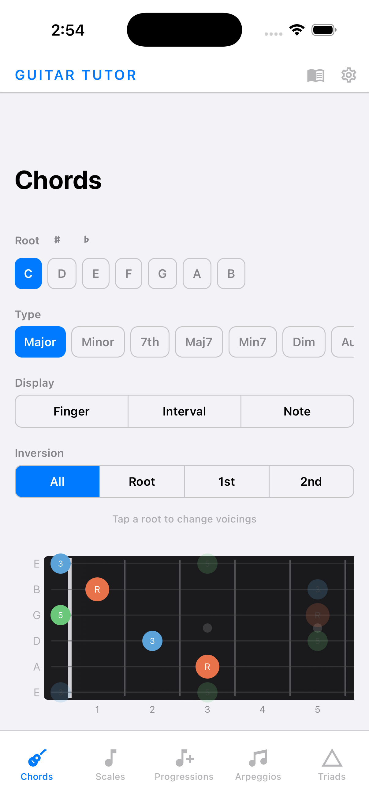
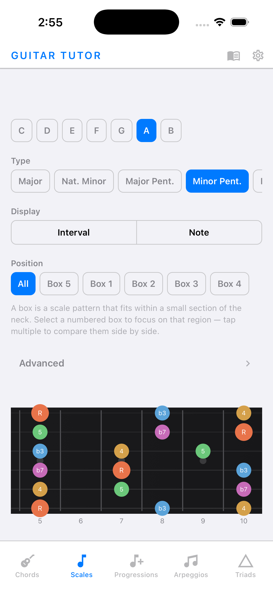
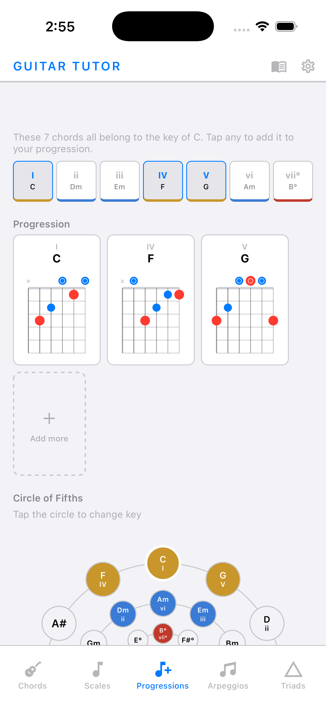
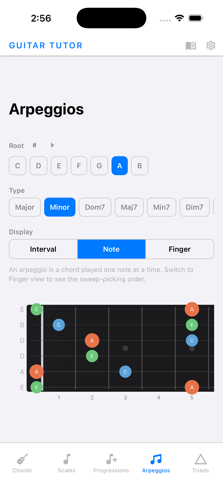
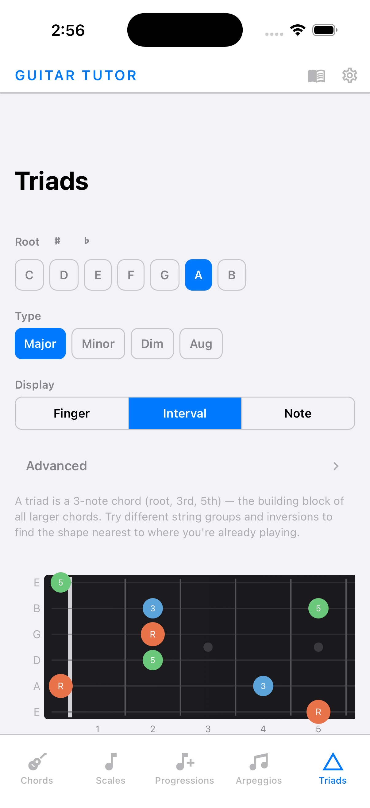

# Guitar Tutor

A React Native mobile app for learning guitar music theory. Visualize chords, scales, arpeggios, triads, and chord progressions on an interactive fretboard — with support for different hand orientations, capo positions, and color themes.

## Screenshots

<p float="left">
  
  
  
  
  
</p>

## Features

- **Chords** — Browse voicings for 12 chord types (Major, Minor, 7th, Maj7, Min7, Dim, Aug, Sus2, Sus4, Dim7, Min7b5, 9th). Filter by inversion. Tap root notes on the fretboard to cycle through voicings. View finger numbers, interval names, or note names.
- **Scales** — Explore 7 scale types (Major, Natural Minor, Major/Minor Pentatonic, Blues, Harmonic Minor, Melodic Minor) across 5–7 fretboard box positions. Multi-select boxes for side-by-side comparison. Full modal support (Ionian through Locrian) for 7-note scales.
- **Arpeggios** — See arpeggio patterns for Major, Minor, Dominant 7, Major 7, Minor 7, Diminished, Augmented, Sus2, and Sus4. Finger mode shows sweep-picking order.
- **Triads** — 3-note shapes for Major, Minor, Diminished, and Augmented triads. Filter by string group (1–2–3, 2–3–4, 3–4–5, 4–5–6) and inversion.
- **Progressions** — Interactive Circle of Fifths. Build diatonic chord progressions (I–vii°) for any key and view chord diagrams for each chord in the sequence.
- **Settings** — Left-handed fretboard mode, light/dark theme, 6 color palettes, capo control (0–7 frets), and ♯/♭ accidental toggle.
- **Glossary** — In-app reference for color coding, display modes, and music theory terms.

## Tech Stack

- [Expo](https://expo.dev) ~54 (managed workflow)
- React Native 0.81 with React 19
- TypeScript 5.9 (strict mode)
- [React Navigation](https://reactnavigation.org) — bottom tabs
- [react-native-svg](https://github.com/software-mansion/react-native-svg) — SVG fretboard rendering
- AsyncStorage — persistent user preferences
- Jest 29 + ts-jest — unit and integration tests

## Prerequisites

- [Node.js](https://nodejs.org) 18 or later
- [Expo CLI](https://docs.expo.dev/more/expo-cli/) — `npm install -g expo-cli`
- For iOS: Xcode 15+ with an iOS simulator configured
- For Android: Android Studio with an Android emulator configured

## Installation

```bash
git clone https://github.com/drewmerc/guitarTutor.git
cd guitarTutor
npm install
```

## Running the App

### iOS Simulator

```bash
npm run ios
```

Expo will build and launch the app in the iOS Simulator. If you have multiple simulators, you can select one interactively from the Expo CLI menu.

### Android Emulator

```bash
npm run android
```

Ensure an Android Virtual Device (AVD) is running in Android Studio before executing this command.

### Expo Go (Physical Device)

```bash
npm start
```

Scan the QR code with the [Expo Go](https://expo.dev/go) app on your device. Both device and development machine must be on the same network.

### Web (Development Only)

```bash
npm run web
```

Opens the app in a browser via Expo's web target. Not all features render identically to native.

## Testing

Run the full test suite:

```bash
npm test
```

Run tests in watch mode during development:

```bash
npx jest --watch
```

Run a specific test file:

```bash
npx jest src/engine/__tests__/chords.test.ts
```

The test suite covers:
- **Engine** — music theory logic (chords, scales, triads, arpeggios, progressions, finger assignment, intervals)
- **Components** — UI components (ChipPicker, SegmentedControl, ChordDiagram, GuitarNeck, etc.)
- **Screens** — integration tests for all 5 main screens

## Debugging

### Expo Developer Menu

Shake your physical device or press `Shift+M` in the terminal to open the Expo developer menu. From here you can reload the app, open React DevTools, and toggle performance overlays.

### React DevTools

```bash
npx react-devtools
```

Connect to inspect the component tree and props while the app is running.

### Metro Bundler Logs

The Metro bundler output in your terminal shows runtime errors and warnings. For more verbose logging, start with:

```bash
npm start -- --clear
```

The `--clear` flag clears the Metro cache, which resolves most "something changed but isn't reflecting" issues.

### TypeScript Errors

```bash
npx tsc --noEmit
```

Runs the TypeScript compiler without emitting files — useful for catching type errors without starting the dev server.

## Project Structure

```
guitarTutor/
├── src/
│   ├── engine/          # Pure music theory logic (no React)
│   │   ├── chords.ts    # Chord voicing generator
│   │   ├── scales.ts    # Scale position computation
│   │   ├── arpeggios.ts # Arpeggio patterns
│   │   ├── triads.ts    # Triad shapes
│   │   ├── progressions.ts
│   │   ├── fingers.ts   # Finger & sweep-order assignment
│   │   ├── fretboard.ts # Fretboard note enumeration
│   │   ├── intervals.ts
│   │   ├── notes.ts
│   │   └── __tests__/
│   ├── components/      # Reusable UI components
│   │   ├── FretboardViewer.tsx
│   │   ├── GuitarNeck.tsx
│   │   ├── ChordDiagram.tsx
│   │   ├── ChipPicker.tsx
│   │   ├── RootPicker.tsx
│   │   └── __tests__/
│   ├── screens/         # Screen-level components
│   │   ├── ChordsScreen.tsx
│   │   ├── ScalesScreen.tsx
│   │   ├── ArpeggiosScreen.tsx
│   │   ├── TriadsScreen.tsx
│   │   ├── ProgressionsScreen.tsx
│   │   ├── SettingsScreen.tsx
│   │   ├── GlossaryScreen.tsx
│   │   └── __tests__/
│   ├── theme/           # Color palettes and ThemeContext
│   └── hooks/           # usePersistentState
├── App.tsx              # Navigation setup
├── app.json             # Expo configuration
├── jest.setup.ts        # Jest mocks
└── package.json
```

### Architecture Notes

- **Engine layer** — pure TypeScript with no React dependencies. All music theory computation lives here and is independently testable.
- **Component layer** — reusable UI primitives. Each component has a single, well-defined purpose and communicates via props.
- **Screen layer** — composes engine output and components into full pages. Manages UI state and user interactions.
- **Theme layer** — `ThemeContext` provides global theme, hand orientation, capo, and accidental settings via React context. All preferences persist to AsyncStorage.

## License

MIT — see [LICENSE](LICENSE).
